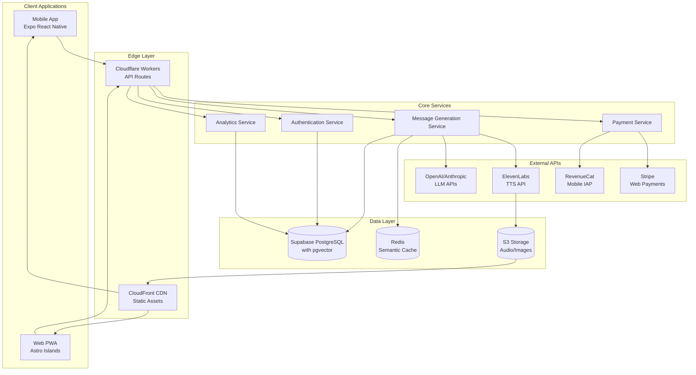

# Design Document

## Overview

AuraFlow is designed as a modern, scalable freemium application delivering AI-generated motivational content across mobile and web platforms. The architecture leverages a Turbo monorepo structure with TypeScript throughout, utilizing Cloudflare Workers for edge computing, Supabase for data persistence with pgvector for semantic similarity, and a comprehensive caching strategy to optimize both performance and costs.

The system is built around five core pillars: AI-powered content generation, freemium business model enforcement, cross-platform synchronization, gamification mechanics, and performance optimization. The design emphasizes sub-150ms perceived latency, semantic content deduplication, and a scalable infrastructure that can handle both individual user requests and broadcast messaging to thousands of users simultaneously.

## Architecture

### High-Level System Architecture



### Monorepo Structure

The application follows a Turbo monorepo pattern optimized for TypeScript development:

```
repo-root/
├── apps/
│   ├── mobile/          # Expo React Native application
│   └── web/             # Astro islands PWA
├── workers/
│   ├── api/             # Cloudflare Worker API routes
│   └── cron/            # Scheduled background jobs
├── packages/
│   ├── common/          # Shared utilities and types
│   └── ui/              # Claymorphism component library
└── infra/
    └── terraform/       # Infrastructure as Code
```

### Technology Stack Rationale

- **Cloudflare Workers**: Chosen for edge computing capabilities, reducing latency for global users and providing cost-effective scaling
- **Supabase with pgvector**: PostgreSQL with vector extensions enables semantic similarity searches for content deduplication while providing robust relational data management
- **Expo React Native**: Enables code sharing between iOS and Android while maintaining native performance
- **Astro Islands**: Provides optimal performance for web with selective hydration, perfect for content-focused application
- **RevenueCat + Stripe**: Industry-standard payment processing with RevenueCat handling mobile IAP complexity

## Components and Interfaces

### Core Service Components

#### MessageGenerationService

The central service responsible for AI content creation and quality assurance:

```typescript
interface MessageGenerationService {
  generateMessage(request: MessageRequest): Promise<GeneratedMessage>
  validateContent(content: string): Promise<ValidationResult>
  checkDuplication(content: string, userId: string): Promise<boolean>
  cacheMessage(message: GeneratedMessage): Promise<void>
}

interface MessageRequest {
  userId: string
  category: MessageCategory
  timeOfDay?: 'morning' | 'evening'
  weatherContext?: WeatherBucket
  locale: string
}

interface GeneratedMessage {
  id: string
  content: string
  category: MessageCategory
  embedding: number[]
  tokens: number
  cost: number
  createdAt: Date
}
```

#### AuthenticationService

Handles user authentication and session management:

```typescript
interface AuthenticationService {
  authenticate(credentials: LoginCredentials): Promise<AuthResult>
  refreshToken(refreshToken: string): Promise<TokenPair>
  validateSession(token: string): Promise<UserSession>
  revokeSession(token: string): Promise<void>
}

interface UserSession {
  userId: string
  email: string
  entitlements: Entitlement[]
  preferences: UserPreferences
}
```

#### PaymentService

Manages subscription lifecycle and entitlements:

```typescript
interface PaymentService {
  processSubscription(request: SubscriptionRequest): Promise<SubscriptionResult>
  validateEntitlements(userId: string): Promise<Entitlement[]>
  handleWebhook(webhook: PaymentWebhook): Promise<void>
  syncRevenueCat(userId: string): Promise<void>
}

interface Entitlement {
  type: 'premium_core' | 'voice_pack'
  expiresAt: Date
  platform: 'ios' | 'android' | 'web'
}
```

### UI Component Architecture

The Claymorphism design system provides consistent visual language across platforms:

#### Core Components

```typescript
// ClayCard - Primary container component
interface ClayCardProps {
  title?: string
  children: React.ReactNode
  elevation?: 'low' | 'medium' | 'high'
  interactive?: boolean
}

// ClayButton - Interactive elements
interface ClayButtonProps {
  variant: 'primary' | 'secondary' | 'ghost'
  size: 'small' | 'medium' | 'large'
  disabled?: boolean
  loading?: boolean
  onPress: () => void
}

// ClayBadge - Achievement and status indicators
interface ClayBadgeProps {
  icon?: string
  label: string
  color?: 'gold' | 'silver' | 'bronze' | 'default'
}
```

#### Design Tokens

```typescript
export const ClayTokens = {
  borderRadius: {
    standard: 16,
    large: 24,
    small: 8
  },
  shadows: {
    clay: '0 8px 32px rgba(0,0,0,0.12), inset 0 1px 0 rgba(255,255,255,0.2)',
    hover: '0 12px 48px rgba(0,0,0,0.15), inset 0 1px 0 rgba(255,255,255,0.3)'
  },
  colors: {
    primary: '#6366F1',
    secondary: '#8B5CF6',
    surface: '#F8FAFC',
    text: '#1E293B'
  }
}
```

### API Interface Design

RESTful API following consistent patterns with proper error handling:

```typescript
// Message Generation Endpoint
POST /api/generate
Request: {
  userId: string
  category: 'motivational' | 'mindfulness' | 'fitness' | 'philosophy' | 'productivity'
  context?: {
    timeOfDay?: string
    weather?: string
  }
}
Response: {
  id: string
  content: string
  tokens: number
  cost: number
} | ErrorResponse

// Daily Drop Endpoint
GET /api/daily-drop?locale=en-US
Response: {
  date: string
  content: string
  challenge?: {
    id: string
    task: string
    points: number
  }
} | ErrorResponse

// TTS Generation Endpoint
POST /api/tts
Request: {
  messageId: string
  voice: 'emma' | 'josh' | 'arnold' | 'domi' | 'elli'
}
Response: {
  url: string
  duration: number
} | ErrorResponse
```

## Data Models

### Database Schema

The PostgreSQL schema with pgvector extension supports both relational data and vector similarity:

```sql
-- Users table with subscription tracking
CREATE TABLE users (
  id UUID PRIMARY KEY DEFAULT gen_random_uuid(),
  email VARCHAR(255) UNIQUE NOT NULL,
  password_hash VARCHAR(255),
  created_at TIMESTAMP DEFAULT NOW(),
  updated_at TIMESTAMP DEFAULT NOW(),
  
  -- Subscription data
  subscription_status VARCHAR(50) DEFAULT 'free',
  premium_expires_at TIMESTAMP,
  voice_pack_expires_at TIMESTAMP,
  
  -- Gamification
  wisdom_points INTEGER DEFAULT 0,
  streak_count INTEGER DEFAULT 0,
  last_activity_date DATE,
  
  -- Preferences
  preferred_categories TEXT[],
  notification_time TIME,
  voice_preference VARCHAR(50),
  timezone VARCHAR(100)
);

-- Messages table with vector embeddings
CREATE TABLE messages (
  id UUID PRIMARY KEY DEFAULT gen_random_uuid(),
  user_id UUID REFERENCES users(id),
  content TEXT NOT NULL,
  category VARCHAR(50) NOT NULL,
  embedding vector(1536), -- OpenAI embedding dimension
  
  -- Generation metadata
  tokens INTEGER,
  cost DECIMAL(10,6),
  temperature DECIMAL(3,2),
  model VARCHAR(100),
  
  -- Context
  time_of_day VARCHAR(20),
  weather_context VARCHAR(50),
  locale VARCHAR(10),
  
  created_at TIMESTAMP DEFAULT NOW(),
  
  -- Performance indexes
  INDEX idx_user_created (user_id, created_at),
  INDEX idx_category (category),
  INDEX idx_embedding USING ivfflat (embedding vector_cosine_ops) WITH (lists = 100)
);

-- Daily drops for broadcast messages
CREATE TABLE daily_drops (
  id UUID PRIMARY KEY DEFAULT gen_random_uuid(),
  date DATE UNIQUE NOT NULL,
  content TEXT NOT NULL,
  locale VARCHAR(10) DEFAULT 'en-US',
  embedding vector(1536),
  created_at TIMESTAMP DEFAULT NOW()
);

-- Daily challenges
CREATE TABLE daily_challenges (
  id UUID PRIMARY KEY DEFAULT gen_random_uuid(),
  date DATE NOT NULL,
  task TEXT NOT NULL,
  points INTEGER DEFAULT 5,
  locale VARCHAR(10) DEFAULT 'en-US',
  created_at TIMESTAMP DEFAULT NOW(),
  
  UNIQUE(date, locale)
);

-- User achievements
CREATE TABLE achievements (
  id UUID PRIMARY KEY DEFAULT gen_random_uuid(),
  name VARCHAR(100) NOT NULL,
  description TEXT,
  icon VARCHAR(100),
  points_required INTEGER,
  badge_color VARCHAR(50)
);

CREATE TABLE user_achievements (
  user_id UUID REFERENCES users(id),
  achievement_id UUID REFERENCES achievements(id),
  earned_at TIMESTAMP DEFAULT NOW(),
  PRIMARY KEY (user_id, achievement_id)
);

-- Audio cache for TTS
CREATE TABLE audio_cache (
  id UUID PRIMARY KEY DEFAULT gen_random_uuid(),
  message_id UUID REFERENCES messages(id),
  voice VARCHAR(50) NOT NULL,
  audio_url TEXT NOT NULL,
  duration INTEGER, -- in seconds
  file_size INTEGER, -- in bytes
  created_at TIMESTAMP DEFAULT NOW(),
  
  UNIQUE(message_id, voice)
);
```

### Semantic Similarity Implementation

The deduplication system uses pgvector for efficient similarity searches:

```sql
-- Check for similar content within 90-day window
SELECT id, content, (embedding <-> $1) as distance
FROM messages 
WHERE user_id = $2 
  AND created_at > NOW() - INTERVAL '90 days'
  AND (embedding <-> $1) < 0.20
ORDER BY distance
LIMIT 1;
```

### Caching Strategy

Multi-layer caching approach for optimal performance:

```typescript
interface CacheStrategy {
  // L1: In-memory cache for frequently accessed data
  memory: {
    userSessions: Map<string, UserSession>
    dailyDrops: Map<string, DailyDrop>
    rateLimits: Map<string, RateLimit>
  }
  
  // L2: Redis for semantic caching and session storage
  redis: {
    semanticCache: Map<string, GeneratedMessage>
    userPreferences: Map<string, UserPreferences>
    bloomFilter: BloomFilter // For lexical deduplication
  }
  
  // L3: CDN for static assets
  cdn: {
    audioFiles: string[] // TTS MP3 files
    shareCards: string[] // Generated quote images
    staticAssets: string[] // App assets
  }
}
```

## Error Handling

### Error Classification and Response Strategy

```typescript
enum ErrorType {
  AUTHENTICATION = 'auth_error',
  AUTHORIZATION = 'auth_forbidden',
  RATE_LIMIT = 'rate_limit_exceeded',
  QUOTA_EXCEEDED = 'quota_exceeded',
  PAYMENT_REQUIRED = 'payment_required',
  CONTENT_GENERATION = 'generation_failed',
  EXTERNAL_API = 'external_api_error',
  VALIDATION = 'validation_error',
  INTERNAL = 'internal_error'
}

interface ErrorResponse {
  error: {
    type: ErrorType
    message: string
    code: string
    details?: Record<string, any>
    retryAfter?: number // For rate limiting
  }
  requestId: string
  timestamp: string
}
```

### Fallback Mechanisms

1. **Content Generation Failures**: Curated fallback library with 100+ pre-written messages per category
2. **API Timeouts**: Circuit breaker pattern with exponential backoff
3. **Payment Processing**: Graceful degradation with retry mechanisms
4. **TTS Failures**: Text-only fallback with user notification

### Monitoring and Alerting

```typescript
interface MonitoringMetrics {
  // Performance metrics
  responseTime: Histogram
  errorRate: Counter
  throughput: Gauge
  
  // Business metrics
  conversionRate: Gauge
  churnRate: Gauge
  arpu: Gauge
  
  // Cost metrics
  tokenUsage: Counter
  apiCosts: Counter
  infrastructureCosts: Gauge
}
```

## Testing Strategy

### Testing Pyramid Implementation

#### Unit Tests (70% coverage target)
- **Framework**: Vitest for fast execution
- **Focus**: Pure functions, business logic, utilities
- **Mocking**: External APIs, database calls
- **Coverage**: All service methods, utility functions, validation logic

```typescript
// Example unit test structure
describe('MessageGenerationService', () => {
  describe('generateMessage', () => {
    it('should generate message within token limits', async () => {
      const service = new MessageGenerationService(mockDeps)
      const result = await service.generateMessage(mockRequest)
      
      expect(result.content.split(' ').length).toBeLessThanOrEqual(40)
      expect(result.tokens).toBeGreaterThan(0)
    })
    
    it('should handle API failures gracefully', async () => {
      mockOpenAI.complete.mockRejectedValue(new Error('API Error'))
      
      const result = await service.generateMessage(mockRequest)
      expect(result.content).toMatch(/fallback content pattern/)
    })
  })
})
```

#### Integration Tests (20% coverage target)
- **Framework**: SuperTest for API testing
- **Focus**: API endpoints, database interactions, external service integration
- **Environment**: Test database with realistic data

```typescript
describe('API Integration', () => {
  it('should generate message with proper authentication', async () => {
    const response = await request(app)
      .post('/api/generate')
      .set('Authorization', `Bearer ${validToken}`)
      .send({ category: 'motivational' })
      .expect(200)
    
    expect(response.body).toHaveProperty('content')
    expect(response.body.content.length).toBeGreaterThan(0)
  })
})
```

#### End-to-End Tests (10% coverage target)
- **Web**: Playwright for critical user journeys
- **Mobile**: Detox for native app flows
- **Focus**: Complete user workflows, payment flows, cross-platform sync

```typescript
// Playwright E2E test example
test('complete premium subscription flow', async ({ page }) => {
  await page.goto('/login')
  await page.fill('[data-testid=email]', 'test@example.com')
  await page.fill('[data-testid=password]', 'password')
  await page.click('[data-testid=login-button]')
  
  await page.click('[data-testid=upgrade-button]')
  await page.click('[data-testid=premium-plan]')
  
  // Mock Stripe checkout success
  await page.route('**/stripe/checkout/**', route => {
    route.fulfill({ status: 200, body: JSON.stringify({ success: true }) })
  })
  
  await expect(page.locator('[data-testid=premium-badge]')).toBeVisible()
})
```

### Cost Regression Testing

Automated CI pipeline to prevent cost increases:

```typescript
// Cost regression test
describe('Cost Regression', () => {
  it('should not exceed token budget per message', async () => {
    const messages = await generateTestMessages(100)
    const avgTokens = messages.reduce((sum, m) => sum + m.tokens, 0) / messages.length
    
    expect(avgTokens).toBeLessThan(BASELINE_TOKENS * 1.1) // 10% tolerance
  })
  
  it('should maintain semantic cache hit rate', async () => {
    const cacheStats = await getCacheStatistics()
    expect(cacheStats.hitRate).toBeGreaterThan(0.6) // 60% minimum
  })
})
```

### Performance Testing

Load testing for scalability validation:

```typescript
// K6 load test script
import http from 'k6/http'
import { check } from 'k6'

export let options = {
  stages: [
    { duration: '2m', target: 100 }, // Ramp up
    { duration: '5m', target: 100 }, // Stay at 100 users
    { duration: '2m', target: 200 }, // Ramp to 200 users
    { duration: '5m', target: 200 }, // Stay at 200 users
    { duration: '2m', target: 0 },   // Ramp down
  ],
  thresholds: {
    http_req_duration: ['p(95)<150'], // 95% of requests under 150ms
    http_req_failed: ['rate<0.01'],   // Error rate under 1%
  }
}

export default function() {
  const response = http.post('https://api.auraflow.com/generate', {
    userId: 'test-user',
    category: 'motivational'
  }, {
    headers: { 'Authorization': 'Bearer test-token' }
  })
  
  check(response, {
    'status is 200': (r) => r.status === 200,
    'response time < 150ms': (r) => r.timings.duration < 150,
    'has content': (r) => JSON.parse(r.body).content.length > 0
  })
}
```

This comprehensive design provides a solid foundation for building a scalable, performant, and maintainable AuraFlow application that meets all the specified requirements while maintaining high code quality and user experience standards.