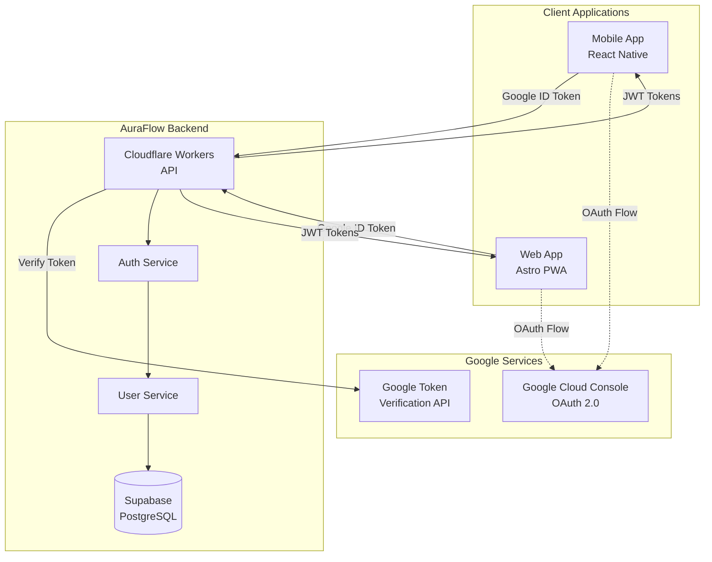
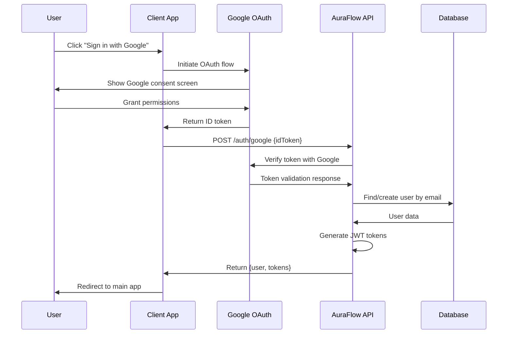

# Google OAuth Login Design Document

## Overview

This design document outlines the implementation of Google OAuth login functionality for AuraFlow. The solution extends the existing JWT-based authentication system to support Google Sign-In alongside the current email/password authentication method. The implementation follows OAuth 2.0 standards and integrates seamlessly with the existing user management system.

The design prioritizes security, user experience, and maintainability while leveraging Google's trusted authentication infrastructure to reduce user friction and potentially increase conversion rates.

## Architecture

### High-Level Architecture



### Authentication Flow



## Components and Interfaces

### 1. Database Schema Updates

The existing users table will be extended to support Google authentication:

```sql
-- Migration: 002_add_google_oauth_support.sql
ALTER TABLE users 
ADD COLUMN google_id VARCHAR(255) UNIQUE,
ADD COLUMN name VARCHAR(255),
ADD COLUMN avatar_url VARCHAR(500),
ALTER COLUMN password_hash DROP NOT NULL;

-- Index for Google ID lookups
CREATE INDEX idx_users_google_id ON users(google_id);

-- Update the constraint to allow either password or Google auth
ALTER TABLE users 
ADD CONSTRAINT users_auth_method_check 
CHECK (password_hash IS NOT NULL OR google_id IS NOT NULL);
```

### 2. Google Authentication Service

```typescript
// packages/common/src/google-auth-service.ts
export interface GoogleUser {
  sub: string;        // Google user ID
  email: string;
  name: string;
  picture: string;
  email_verified: boolean;
  aud: string;        // Client ID
  exp: number;        // Expiration
  iat: number;        // Issued at
}

export interface GoogleAuthConfig {
  clientId: string;
  clientSecret: string;
  tokenInfoUrl: string;
}

export class GoogleAuthService {
  private config: GoogleAuthConfig;

  constructor(config: GoogleAuthConfig) {
    this.config = config;
  }

  async verifyIdToken(idToken: string): Promise<GoogleUser> {
    // Verify token with Google's tokeninfo endpoint
    const response = await fetch(
      `${this.config.tokenInfoUrl}?id_token=${idToken}`
    );
    
    if (!response.ok) {
      throw new AuthenticationError('Invalid Google token');
    }
    
    const tokenInfo = await response.json();
    
    // Validate audience (client ID)
    if (tokenInfo.aud !== this.config.clientId) {
      throw new AuthenticationError('Invalid token audience');
    }
    
    // Check if token is expired
    if (Date.now() / 1000 > tokenInfo.exp) {
      throw new AuthenticationError('Token expired');
    }
    
    // Verify email is verified
    if (!tokenInfo.email_verified) {
      throw new AuthenticationError('Email not verified with Google');
    }
    
    return tokenInfo as GoogleUser;
  }
}
```

### 3. Enhanced User Service

```typescript
// Extension to packages/common/src/user-service.ts
export interface CreateGoogleUserRequest {
  email: string;
  googleId: string;
  name: string;
  avatarUrl?: string;
  timezone?: string;
}

export class UserService {
  // ... existing methods ...

  async findUserByGoogleId(googleId: string): Promise<User | null> {
    const { data, error } = await this.getSupabase()
      .from('users')
      .select('*')
      .eq('google_id', googleId)
      .single();

    if (error?.code === 'PGRST116') return null;
    if (error) throw new DatabaseError(`Failed to find user: ${error.message}`);
    
    return this.mapDatabaseUserToUser(data);
  }

  async createGoogleUser(userData: CreateGoogleUserRequest): Promise<User> {
    const { data, error } = await this.getSupabase()
      .from('users')
      .insert({
        email: userData.email.toLowerCase(),
        google_id: userData.googleId,
        name: userData.name,
        avatar_url: userData.avatarUrl,
        timezone: userData.timezone || 'UTC',
        subscription_status: 'free',
        wisdom_points: 0,
        streak_count: 0,
        preferred_categories: []
      })
      .select()
      .single();

    if (error) {
      if (error.code === '23505') {
        throw new ValidationError('User with this email or Google ID already exists');
      }
      throw new DatabaseError(`Failed to create user: ${error.message}`);
    }

    return this.mapDatabaseUserToUser(data);
  }

  async linkGoogleAccount(userId: string, googleId: string, name: string, avatarUrl?: string): Promise<User> {
    const { data, error } = await this.getSupabase()
      .from('users')
      .update({
        google_id: googleId,
        name: name,
        avatar_url: avatarUrl,
        updated_at: new Date().toISOString()
      })
      .eq('id', userId)
      .select()
      .single();

    if (error) {
      throw new DatabaseError(`Failed to link Google account: ${error.message}`);
    }

    return this.mapDatabaseUserToUser(data);
  }

  private mapDatabaseUserToUser(dbUser: any): User {
    return {
      // ... existing mapping ...
      googleId: dbUser.google_id,
      name: dbUser.name,
      avatarUrl: dbUser.avatar_url
    };
  }
}
```

### 4. API Route Implementation

```typescript
// workers/api/src/routes/auth.ts - New Google auth endpoint
interface GoogleLoginRequest {
  idToken: string;
}

// POST /auth/google - Google OAuth login
auth.post('/google', async (c) => {
  try {
    await ensureDbInitialized();
    
    const body = await c.req.json() as GoogleLoginRequest;

    if (!body.idToken) {
      return c.json<ErrorResponse>({
        error: 'Validation Error',
        message: 'Google ID token is required'
      }, 400);
    }

    // Verify Google token
    const googleUser = await googleAuthService.verifyIdToken(body.idToken);
    
    // Try to find existing user by Google ID first
    let user = await userService.findUserByGoogleId(googleUser.sub);
    
    if (!user) {
      // Try to find by email (for account linking)
      const existingUser = await userService.findUserByEmail(googleUser.email);
      
      if (existingUser) {
        // Link Google account to existing user
        user = await userService.linkGoogleAccount(
          existingUser.id,
          googleUser.sub,
          googleUser.name,
          googleUser.picture
        );
        
        logger.info('Google account linked to existing user', {
          userId: user.id,
          email: user.email
        });
      } else {
        // Create new user with Google account
        user = await userService.createGoogleUser({
          email: googleUser.email,
          googleId: googleUser.sub,
          name: googleUser.name,
          avatarUrl: googleUser.picture
        });
        
        logger.info('New user created via Google OAuth', {
          userId: user.id,
          email: user.email
        });
      }
    }

    // Generate JWT tokens
    const tokens = authService.generateTokens({
      id: user.id,
      email: user.email,
      subscriptionStatus: user.subscriptionStatus
    });

    return c.json<AuthResponse>({
      user: {
        id: user.id,
        email: user.email,
        subscriptionStatus: user.subscriptionStatus,
        name: user.name,
        avatarUrl: user.avatarUrl
      },
      tokens
    });

  } catch (error) {
    if (error instanceof AuthenticationError) {
      logger.warn('Google authentication failed', { message: error.message });
      return c.json<ErrorResponse>({
        error: 'Authentication Error',
        message: error.message
      }, 401);
    }

    logger.error('Google login error', {}, error as Error);
    return c.json<ErrorResponse>({
      error: 'Internal Server Error',
      message: 'An error occurred during Google login'
    }, 500);
  }
});
```

### 5. Mobile Implementation (React Native)

```typescript
// apps/mobile/src/services/GoogleAuthService.ts
import { GoogleSignin, statusCodes } from '@react-native-google-signin/google-signin';

export class MobileGoogleAuthService {
  static configure() {
    GoogleSignin.configure({
      webClientId: process.env.EXPO_PUBLIC_GOOGLE_WEB_CLIENT_ID,
      iosClientId: process.env.EXPO_PUBLIC_GOOGLE_IOS_CLIENT_ID,
      androidClientId: process.env.EXPO_PUBLIC_GOOGLE_ANDROID_CLIENT_ID,
      offlineAccess: false,
      hostedDomain: '',
      forceCodeForRefreshToken: false,
    });
  }

  static async signIn(): Promise<string> {
    try {
      await GoogleSignin.hasPlayServices();
      const userInfo = await GoogleSignin.signIn();
      
      if (!userInfo.idToken) {
        throw new Error('No ID token received from Google');
      }
      
      return userInfo.idToken;
    } catch (error: any) {
      if (error.code === statusCodes.SIGN_IN_CANCELLED) {
        throw new Error('Google sign-in was cancelled');
      } else if (error.code === statusCodes.IN_PROGRESS) {
        throw new Error('Google sign-in is already in progress');
      } else if (error.code === statusCodes.PLAY_SERVICES_NOT_AVAILABLE) {
        throw new Error('Google Play Services not available');
      }
      
      throw new Error(`Google sign-in failed: ${error.message}`);
    }
  }

  static async signOut(): Promise<void> {
    try {
      await GoogleSignin.signOut();
    } catch (error) {
      console.warn('Google sign-out failed:', error);
    }
  }
}
```

### 6. Web Implementation (Astro)

```typescript
// apps/web/src/services/GoogleAuthService.ts
export class WebGoogleAuthService {
  private clientId: string;

  constructor(clientId: string) {
    this.clientId = clientId;
  }

  async initializeGoogleAuth(): Promise<void> {
    return new Promise((resolve, reject) => {
      const script = document.createElement('script');
      script.src = 'https://accounts.google.com/gsi/client';
      script.onload = () => resolve();
      script.onerror = () => reject(new Error('Failed to load Google Sign-In script'));
      document.head.appendChild(script);
    });
  }

  async signIn(): Promise<string> {
    return new Promise((resolve, reject) => {
      // @ts-ignore - Google Identity Services
      window.google.accounts.id.initialize({
        client_id: this.clientId,
        callback: (response: any) => {
          if (response.credential) {
            resolve(response.credential);
          } else {
            reject(new Error('No credential received from Google'));
          }
        },
        auto_select: false,
        cancel_on_tap_outside: true,
      });

      // @ts-ignore
      window.google.accounts.id.prompt((notification: any) => {
        if (notification.isNotDisplayed() || notification.isSkippedMoment()) {
          reject(new Error('Google sign-in prompt was not displayed or skipped'));
        }
      });
    });
  }

  renderSignInButton(elementId: string): void {
    // @ts-ignore
    window.google.accounts.id.renderButton(
      document.getElementById(elementId),
      {
        theme: 'outline',
        size: 'large',
        type: 'standard',
        shape: 'rectangular',
        text: 'signin_with',
        logo_alignment: 'left',
      }
    );
  }
}
```

## Data Models

### Updated User Interface

```typescript
// packages/common/src/types.ts
export interface User {
  id: string;
  email: string;
  googleId?: string;        // New field
  name?: string;            // New field
  avatarUrl?: string;       // New field
  createdAt: Date;
  updatedAt: Date;
  subscriptionStatus: SubscriptionTier;
  premiumExpiresAt?: Date;
  voicePackExpiresAt?: Date;
  wisdomPoints: number;
  streakCount: number;
  lastActivityDate?: Date;
  preferredCategories: string[];
  notificationTime?: string;
  voicePreference?: string;
  timezone: string;
}
```

### Environment Variables

```bash
# Google OAuth Configuration
GOOGLE_CLIENT_ID=your-google-client-id
GOOGLE_CLIENT_SECRET=your-google-client-secret
GOOGLE_TOKEN_INFO_URL=https://oauth2.googleapis.com/tokeninfo

# Mobile-specific (Expo)
EXPO_PUBLIC_GOOGLE_WEB_CLIENT_ID=your-web-client-id
EXPO_PUBLIC_GOOGLE_IOS_CLIENT_ID=your-ios-client-id
EXPO_PUBLIC_GOOGLE_ANDROID_CLIENT_ID=your-android-client-id
```

## Error Handling

### Error Types and Responses

1. **Token Verification Errors**
   - Invalid token format
   - Expired token
   - Wrong audience (client ID mismatch)
   - Unverified email

2. **User Creation Errors**
   - Duplicate email/Google ID
   - Database connection issues
   - Validation failures

3. **Client-Side Errors**
   - Google Services unavailable
   - User cancellation
   - Network connectivity issues
   - Missing configuration

### Error Handling Strategy

```typescript
// Centralized error handling for Google auth
export class GoogleAuthErrorHandler {
  static handleTokenVerificationError(error: any): AuthenticationError {
    if (error.message.includes('expired')) {
      return new AuthenticationError('Google token has expired. Please sign in again.');
    }
    if (error.message.includes('audience')) {
      return new AuthenticationError('Invalid Google token. Please try again.');
    }
    if (error.message.includes('email_verified')) {
      return new AuthenticationError('Please verify your email with Google first.');
    }
    return new AuthenticationError('Google authentication failed. Please try again.');
  }

  static handleClientError(error: any): string {
    if (error.code === 'SIGN_IN_CANCELLED') {
      return 'Sign-in was cancelled. Please try again.';
    }
    if (error.code === 'PLAY_SERVICES_NOT_AVAILABLE') {
      return 'Google Play Services is required. Please update and try again.';
    }
    return 'Google sign-in failed. Please check your connection and try again.';
  }
}
```

## Testing Strategy

### Unit Tests

1. **Google Auth Service Tests**
   - Token verification with valid tokens
   - Token verification with invalid/expired tokens
   - Error handling for various failure scenarios

2. **User Service Tests**
   - Google user creation
   - Account linking scenarios
   - Duplicate handling

3. **API Endpoint Tests**
   - Successful Google login flow
   - Error responses for invalid tokens
   - User creation vs. linking logic

### Integration Tests

1. **End-to-End Authentication Flow**
   - Complete Google OAuth flow simulation
   - Token exchange and JWT generation
   - User session management

2. **Cross-Platform Testing**
   - Mobile Google Sign-In flow
   - Web OAuth flow
   - Consistent user experience

### Security Tests

1. **Token Security**
   - Token tampering detection
   - Expired token handling
   - Audience validation

2. **Account Security**
   - Prevent account takeover via email
   - Proper account linking validation
   - Session management security

## Performance Considerations

### Caching Strategy

1. **Google Token Verification**
   - Cache valid tokens for short periods (5 minutes)
   - Implement token blacklisting for revoked tokens

2. **User Profile Data**
   - Cache Google profile information
   - Update avatar URLs periodically

### Rate Limiting

1. **Google API Calls**
   - Implement exponential backoff for token verification
   - Monitor Google API quotas and limits

2. **Authentication Endpoints**
   - Rate limit Google auth attempts per IP
   - Implement CAPTCHA for suspicious activity

## Security Considerations

### Token Security

1. **ID Token Validation**
   - Always verify tokens with Google's servers
   - Validate audience, expiration, and signature
   - Never trust client-provided user information

2. **Secure Storage**
   - Store Google IDs securely in database
   - Never log or expose sensitive token data
   - Implement proper token rotation

### Privacy Compliance

1. **Data Minimization**
   - Only request necessary OAuth scopes (profile, email)
   - Store minimal required user information
   - Provide clear privacy disclosures

2. **User Consent**
   - Clear consent flow for data usage
   - Option to unlink Google account
   - Respect user privacy preferences

### Account Security

1. **Account Linking**
   - Verify email ownership before linking accounts
   - Prevent unauthorized account takeovers
   - Audit trail for account changes

2. **Session Management**
   - Proper JWT token handling
   - Secure logout from Google sessions
   - Monitor for suspicious authentication patterns